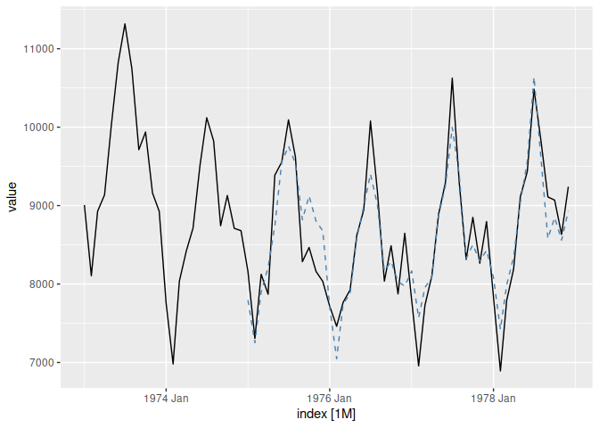

<!-- README.md is generated from README.Rmd. Please edit that file -->

# fable.timegpt

<!-- badges: start -->

[](https://lifecycle.r-lib.org/articles/stages.html#experimental)
[](https://CRAN.R-project.org/package=fable.timegpt)
<!-- badges: end -->

The fable.timegpt package provides a fable compatible SDK for the
[Nixtla](https://www.nixtla.io/)’s [TimeGPT
API](https://docs.nixtla.io/).

## Installation

You can install the development version of fable.timegpt from
[GitHub](https://github.com/) with:

``` r
# install.packages("devtools")
devtools::install_github("mitchelloharawild/fable.timegpt")
```

Using the TimeGPT API requires a token, you can request one at
<https://dashboard.nixtla.io/>. It is recommended that you store the
token as an R environment variable, which can be done by adding the line
`TIMEGPT_TOKEN=<your_token_here>` to the `.Renviron` file (which can be
opened with `usethis::edit_r_environ()`). Alternatively you can specify
the token directly in the `forecast()` function.

## Example

``` r
library(fable.timegpt)
#> Loading required package: fabletools
uad <- as_tsibble(USAccDeaths)
fc <- uad |> 
  model(TimeGPT(value)) |> 
  forecast(h = 10, level = c(50, 80, 95))
fc
#> # A fable: 10 x 4 [1M]
#> # Key:     .model [1]
#>    .model            index         value  .mean
#>    <chr>             <mth>        <dist>  <dbl>
#>  1 TimeGPT(value) 1979 Jan percentile[7]  8193.
#>  2 TimeGPT(value) 1979 Feb percentile[7]  7143.
#>  3 TimeGPT(value) 1979 Mar percentile[7]  8025.
#>  4 TimeGPT(value) 1979 Apr percentile[7]  8513.
#>  5 TimeGPT(value) 1979 May percentile[7]  9338.
#>  6 TimeGPT(value) 1979 Jun percentile[7]  9810.
#>  7 TimeGPT(value) 1979 Jul percentile[7] 10841.
#>  8 TimeGPT(value) 1979 Aug percentile[7]  9946.
#>  9 TimeGPT(value) 1979 Sep percentile[7]  9116.
#> 10 TimeGPT(value) 1979 Oct percentile[7]  9126.
fc |> 
  autoplot(uad, level = c(50, 80, 95))
```


